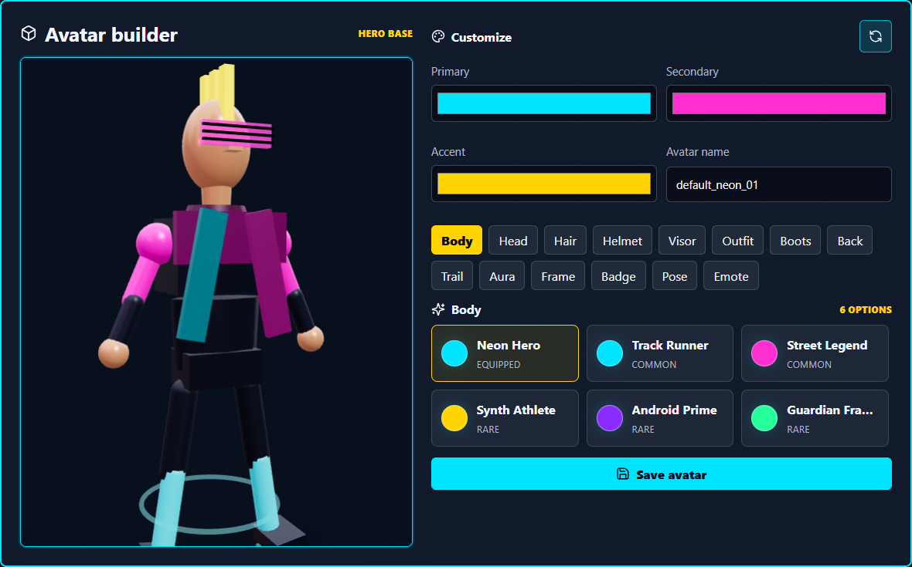

# Nexus Arcade Arena

Fresh scaffold for Nexus Arcade Hub and Nexus Player Passport.

## Preview



## What is included

- `apps/api` - Express, MongoDB/Mongoose, Socket.IO, Player Passport APIs.
- `apps/web` - Vite React phone/profile/operator web app.
- `apps/hub` - Electron + Vite React cabinet Hub.
- `packages/shared` - integration contracts, DTO validation, XP rules, and game payload schemas (`nexus-arcade-shared`).
- `tools/game-simulator` - Godot-compatible CLI simulator for local game contract tests.
- `games/nexus-relay` - Godot 4 source for the adaptive 3D solo/co-op mission game.
- `apps/rush-run` - legacy browser fallback kept for build compatibility while Godot becomes the primary game runtime.
- `docs` - pilot checklist and integration notes.

## Quick start

```powershell
npm install
copy .env.example .env
npm run mongo:up
npm run dev
```

For a clean Windows setup that also refreshes the Nexus Relay Godot assets and verifies Godot on PATH:

```powershell
npm run first-run
```

To run setup and open the preview services plus the Electron Hub:

```powershell
npm run first-run:start
```

The API and phone/operator web app prefer a LAN-reachable URL when no explicit base URL is configured. The local defaults still use ports `3000` for the API, `5173` for the phone/operator web app, and `5174` for the Hub renderer.

To run the Player Passport flow against local Supabase Auth:

```powershell
npm run supabase:setup
npm run dev:supabase
```

`supabase:setup` starts the local Supabase Docker stack and writes the local Auth URL/JWKS/anon key into `.env`. The Nexus API still stores Player Passport profile, avatar, XP, stats, and game data in MongoDB during this phase; Supabase is used for player proof of identity.

For Nexus-owned production infrastructure, bootstrap the self-hosted Supabase deployment and start the production Compose project:

```powershell
npm run selfhost:supabase:bootstrap -- -Domain arcade.costleyentertainment.com -ApiDomain api.arcade.costleyentertainment.com -IdentityDomain identity.arcade.costleyentertainment.com -Email admin@costleyentertainment.com
npm run selfhost:up
```

This uses the official Supabase Docker bundle under `deploy/self-hosted-supabase/upstream`, generates a Git-ignored production env file, and runs self-hosted Supabase, Nexus API, Nexus web, MongoDB, and Caddy together. See `docs/production-auth-readiness.md` and `deploy/self-hosted-supabase/README.md`.

Local V1 logins require a 6-digit 2FA challenge. In development, `EXPOSE_DEV_2FA_CODES=true` returns the code in the API response/UI so the flow can be tested without email or SMS infrastructure. The default local operator credentials are `OPERATOR_ID=operator` and `OPERATOR_PIN=000000`; change them in `.env` for any shared environment.

The operator console is available at `/operator/config` after operator login. It includes tenant identity, deployment environment, site/cabinet defaults, app/API base URLs, QR URL preview, cloud identity provider settings, 2FA challenge policy, QR session TTL, and OAuth issuer settings. These values are persisted in MongoDB and the API reads the relevant settings at runtime. QR codes use the configured App base URL and only carry the cabinet pairing session ID; for phones, set the App base URL to a LAN or public HTTPS URL rather than `localhost`.

## Nexus Relay / Godot Handoff

Set `GODOT_NEXUS_RELAY_PATH` to the exported Nexus Relay executable. The Hub passes:

```text
--nexus-session-payload <jsonPath> --nexus-result-callback <localUrl>
```

If no executable path is configured, service tests use `tools/game-simulator` to validate the same contract without Godot installed.

The Godot runtime consumes `launchPayload.players[].avatarRuntime`, applies Player Passport display names and avatar colors, runs a player-join countdown, then reports `solo` or `co-op` based on the joined player count. Game builds should follow the same runtime manifest instead of coupling to cabinet-only player state.

The curated Nexus Relay asset set now includes Kenney station modules, Quaternius GLB gameplay silhouettes, and ambientCG PBR materials. Procedural-generation rules and the refresh script are documented in `docs/nexus-relay-asset-pipeline.md`.

## Player Passport integration boundary

Player Passport is cloud-first and Nexus-owned. Player login is backed by Supabase Auth, either hosted or self-hosted under the Nexus domain, while Nexus stores profile, avatar, XP, stats, achievements, game sessions, and leaderboard data in the cloud application database. MongoDB may store application data, but it is not the identity provider.

Cabinets do not store passwords or long-lived player auth tokens. When online, a cabinet displays a short-lived QR pairing session such as `/play/claim?session=<sessionId>`. The phone authenticates with the cloud identity provider, claims P1 or P2 through the Nexus API, and the cabinet receives only display name, avatar manifest, level, slot, and cabinet-scoped session data.

Offline mode is guest/cache/queue only. If internet drops after a player is already logged in, the cabinet can continue that active session for a limited grace window and queue the result. If the cabinet is offline before login, new Player Passport login is disabled and only guest play plus local/offline-pending scores are allowed.

Other systems should integrate through `packages/shared` schemas and the `/api/player`, `/api/arcade`, `/api/auth`, `/oauth`, and `/api/leaderboards` APIs. Cabinet-specific behavior stays in `apps/hub`; reusable identity, avatar, progression, session, auth-client, token, and leaderboard contracts live in shared/API code.

Avatar and inventory endpoints:

- `GET /api/player/avatar/catalog`
- `GET /api/player/me/inventory`
- `PATCH /api/player/me/avatar`
- `PATCH /api/player/me/equipment`

OAuth-style endpoints:

- `GET /.well-known/oauth-authorization-server`
- `POST /api/auth/clients`
- `GET /oauth/authorize/summary`
- `GET /oauth/authorize` through the web consent screen, then API authorization-code redirect
- `POST /oauth/token`
- `POST /oauth/introspect`
- `GET /api/passport/me`

Passport access tokens are scope-filtered. `GET /api/passport/me` returns only the profile, avatar runtime manifest, stats, achievements, or leaderboard data granted to the OAuth/auth client. Avatar runtime manifests are versioned as `nexus-avatar-manifest/v1` so Nexus Relay and future 2D/3D games can consume the same equipment, color, morphology, add-on, and emote contract.

## Repository hygiene

Keep source, contracts, tests, docs, and small hand-authored assets in Git. Do not commit generated builds, runtime queues, local databases, Godot exports, installers, archives, videos, audio, or large raw art files.

Before committing:

```powershell
npm test
npm run build
npm run repo:large-files
git status --short
```

Large release artifacts should be attached to GitHub Releases or stored in external asset storage. If a binary asset must become part of the source tree, add a short note explaining why and keep it small enough for normal clone/pull workflows.

## Testing and previews

See `docs/testing-and-previews.md` for Docker-backed integration testing and preview commands.
